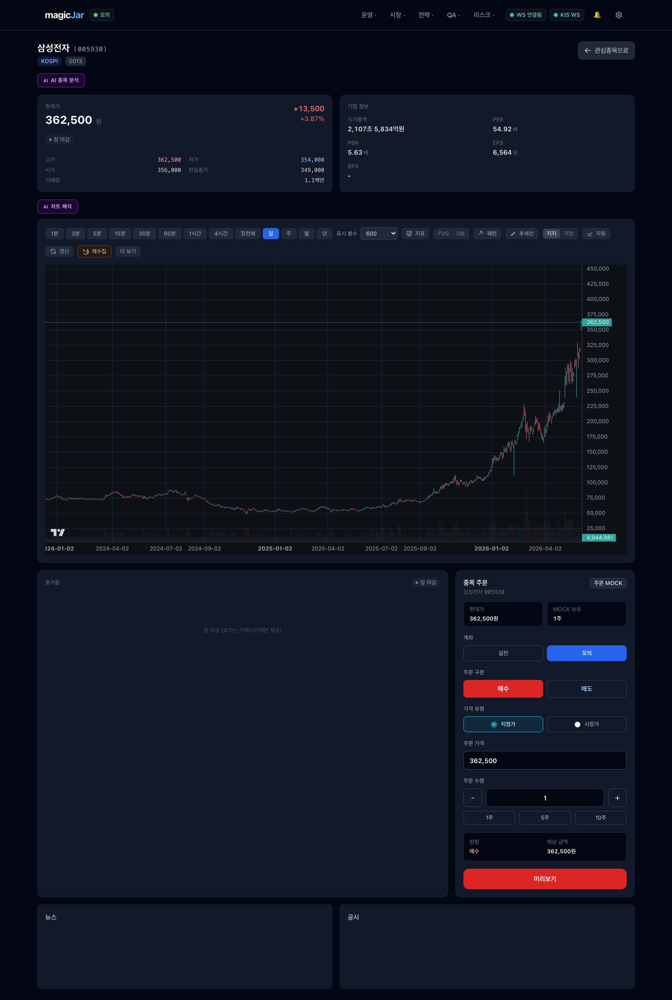
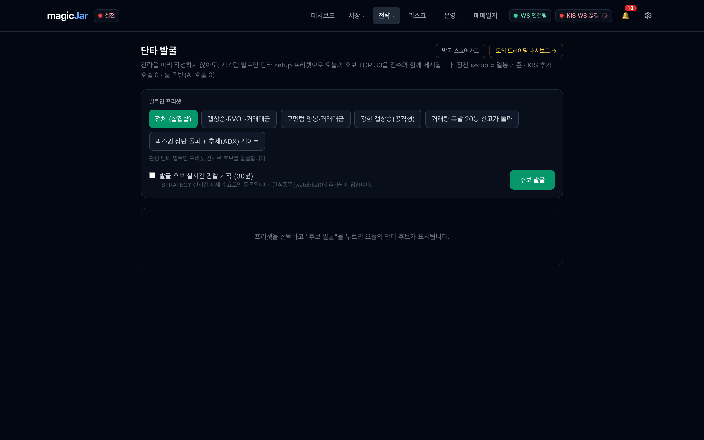
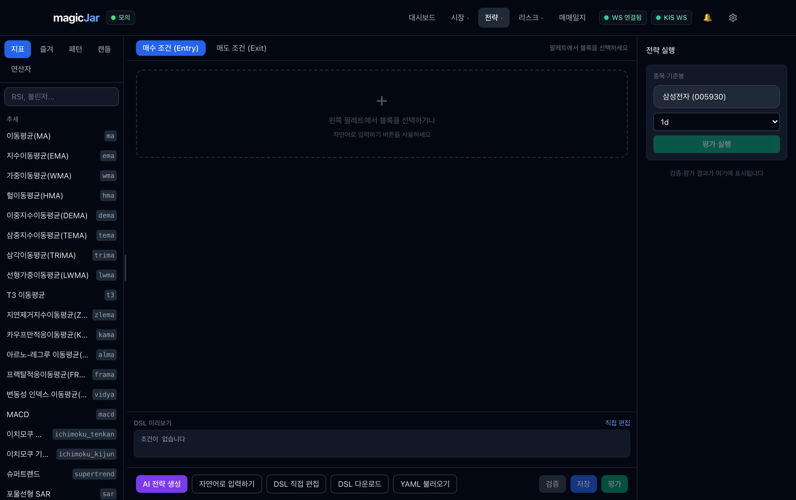
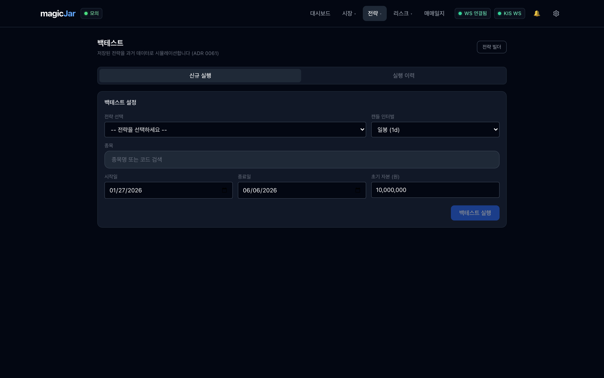
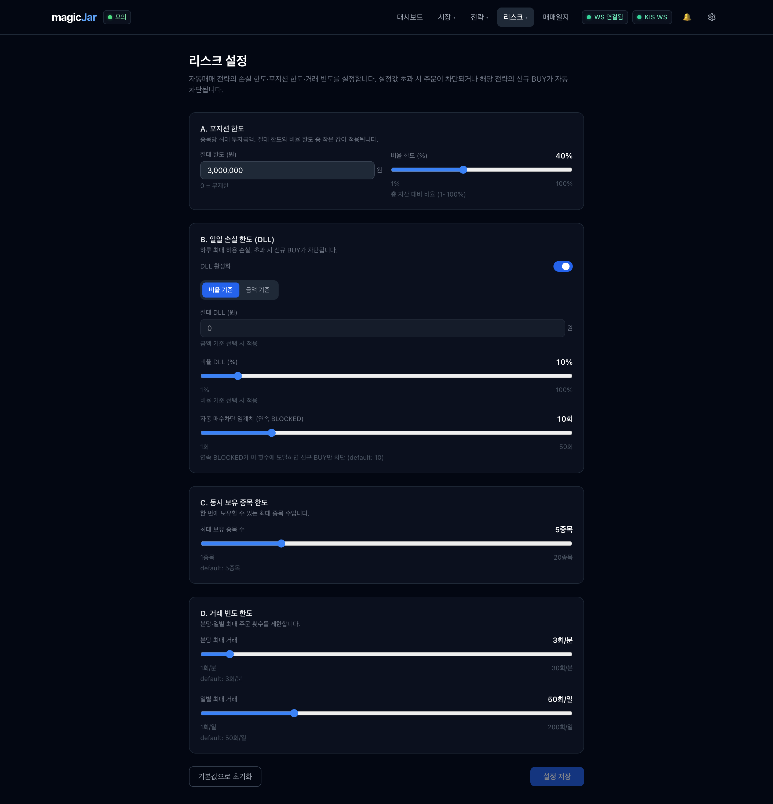
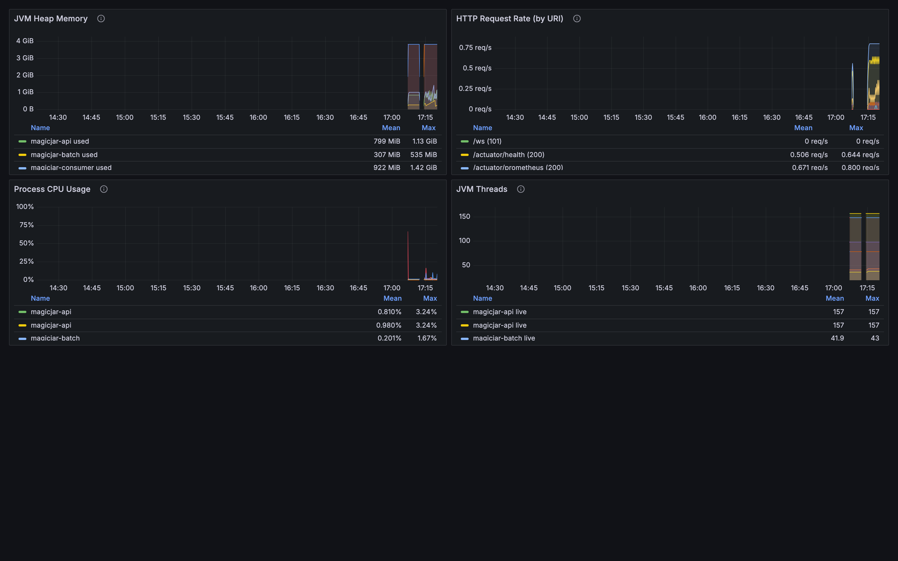

# magicJar (마법의항아리)

### 개인 맞춤형 한국 주식 자동매매 시스템 — 엔지니어링 포트폴리오

<div align="center">

**룰 기반 quant trading 본체 + AI 분석 보조 · 실시간 시세부터 주문·리스크 가드레일까지 end-to-end**

기간 2026년 4월 ~ 진행 중 · 1인 개발 (AI 멀티에이전트 하네스 오케스트레이션)

🌐 라이브 사이트 [sp-daewoon.github.io/magicjar-portfolio](https://sp-daewoon.github.io/magicjar-portfolio/) · 📊 [활동 통계 대시보드](https://sp-daewoon.github.io/magicjar-portfolio/stats.html)

</div>

| 규모 | 스택 |
|---|---|
| **1,850+** 커밋 · **120+** PR · **55** 릴리즈 · **ADR 121건** · **257K+** LOC · **7** 모듈 | Kotlin · Spring Boot 3.3 · JDK 21 · React 19 · TypeScript · KIS OpenAPI · Kafka · PostgreSQL · Redis · Prometheus/Grafana |

> 본 문서는 채용·포트폴리오 목적입니다. 운영 소스·시크릿·실계좌 정보는 포함하지 않으며, 코드 발췌는 설계 의도를 보이기 위해 일부 식별자·주석을 단순화했습니다.

---

## 이 문서를 읽는 법 — 3막 구성

이 포트폴리오는 면접관이 다음 순서로 자연스럽게 따라가도록 설계했습니다.

1. **무엇을 만들었나** — 풀스택 시스템 전체 그림과 실제 동작 화면 (역량 증명)
2. **어떻게 풀었나** — 금전이 오가는 실시간 시스템에서 마주친 대표 엔지니어링 난제 4건과 해결 코드 (백엔드 깊이)
3. **어떻게 이 규모를 혼자 만들었나** — 7개 전문 AI 에이전트를 설계·지휘한 멀티에이전트 개발 하네스 (차별점)

> 1·2막은 "이 사람이 무엇을 할 수 있는가"를, 3막은 "어떻게 1인이 1,850커밋·ADR 121건 규모를 추적 가능한 품질로 만들어냈는가"를 답합니다.

---

# 1막 — 무엇을 만들었나

## 1.1 30초 요약

한국투자증권(KIS) OpenAPI를 통해 **실시간 시세·호가·체결을 수집**하고, 사용자가 정의한 **기술적 지표·차트 조건식(DSL)으로 매매 전략을 표현**, **과거 데이터로 백테스트**한 뒤, **시그널 생성 → 주문 실행 → 포지션·리스크 관리**까지 이어지는 엔드투엔드 자동매매 파이프라인입니다.

핵심 설계 원칙은 **"룰이 본체, AI는 보조"** 입니다. 매매 결정은 전적으로 규칙·시그널이 내리고, AI는 사용자가 명시적으로 트리거할 때만 뉴스·공시 감성이나 전략 설명 같은 분석 코멘트를 제공합니다 — **AI는 매매 결정권이 0입니다.** 실계좌 주문은 `MODE=REAL` + `ALLOW_REAL=true` 이중 게이트로 차단되어, 안전이 코드 구조로 강제됩니다.

## 1.2 시스템 개요 — 4영역 데이터 흐름

```
  ┌─────────────┐   ┌──────────────┐   ┌──────────────────┐   ┌────────────┐
  │ A. 데이터    │ → │ B. 분석·전략 │ → │ C. 의사결정·실행 │ → │ D. 운영    │
  │   수집·정합  │   │              │   │                  │   │            │
  ├─────────────┤   ├──────────────┤   ├──────────────────┤   ├────────────┤
  │ KIS WS tick  │   │ 지표 라이브러리│  │ 시그널 dispatch  │   │ Prometheus │
  │ REST 일·분봉 │   │ 차트 DSL 파서 │  │ 주문 실행        │   │ Grafana    │
  │ DART 공시·뉴스│  │ StrategyEval  │  │ 분할매수/분할익절 │   │ 알림 라우팅 │
  │              │   │ 백테스트 엔진 │  │ 실계좌 이중 게이트│   │ DR drill   │
  └─────────────┘   └──────────────┘   └──────────────────┘   └────────────┘
       권위=WS tick      FVG·OrderBlock      KillSwitch·정합워커     SLO 대시보드
       REST=bootstrap     스마트머니 개념      PENDING_RECONCILE
```

- **데이터 계층(A)** — KIS WebSocket 실시간 tick(체결·호가)이 권위 소스, REST 일·분봉은 bootstrap·backfill·fallback. DART 공시·뉴스 수집.
- **분석·전략 계층(B)** — 기술적 지표 라이브러리 + 차트 조건식 DSL 파서 + StrategyEvaluator + 백테스트 엔진. FVG·Order Block 등 스마트머니 개념 포함.
- **의사결정·실행 계층(C)** — 시그널 dispatch + 주문 실행 + 전략별 분할매수/분할익절(scale-in/partial-exit) 포지션 관리.
- **운영 계층(D)** — Prometheus가 api·batch·consumer 3개 모듈을 15초 주기로 scrape, Grafana가 JVM·HTTP·KIS Rate Limit·SLO 대시보드를 auto-provision.

## 1.3 아키텍처 — JVM 7모듈 헥사고날 + React SPA

```
JVM 7 모듈 (Kotlin / Spring Boot 3.3 / JDK 21 / Gradle KTS 멀티모듈)
├─ domain/              순수 도메인 + port (Spring·JPA 의존 0)
├─ api/                 REST/STOMP + 외부 어댑터(KIS·DART·Naver) + Kafka producer
├─ batch/               Spring Batch — 일봉 backfill · 전략 백테스트 잡
├─ consumer/            Kafka 소비 + KIS WS + 시그널·주문 dispatch + AI 분석
├─ persistence-shared/  Outbox + JPA 어댑터 공유
├─ indicator-impl/      지표 계산 라이브러리 (api·consumer 공유)
└─ strategy-engine/     DSL 파서 + StrategyEvaluator (api·consumer 공유)

frontend/   React 19 SPA — Watchlist · 실시간 시세 · 차트 · 백테스트 · AI 인사이트
```

핵심은 **도메인 모듈이 Spring·JPA·Kafka에 의존하지 않는다**는 점입니다(헥사고날). 비즈니스 규칙은 프레임워크와 독립적으로 테스트·이해되고, 외부 연동(KIS·DART·Naver)은 모두 어댑터로 격리되어 옵션·fallback이 명시됩니다. 모든 아키텍처 결정은 ADR(Architecture Decision Record) 121건으로 추적됩니다.

## 1.4 핵심 화면

> 로컬 풀스택(Spring Boot API · Kafka consumer · React 프런트) 기동 후 Playwright로 캡처 · 실데이터 기반. 전체 17종 갤러리는 [라이브 사이트](https://sp-daewoon.github.io/magicjar-portfolio/showcase/screens/) 참고.

### 종목 상세 — 실시간 차트 · 호가 · 주문



실시간 시세 · TradingView 캔들차트 · FVG/OrderBlock 오버레이 · 호가창 뎁스 · AI 종목 분석 · 주문 패널. 호가창은 "표시 중에만" 구독하고 이탈 시 즉시 해제해 WS 수요를 최소화합니다.

### 단타 발굴 — 룰 기반 후보 랭킹 + 신호 해석



빌트인 setup 프리셋으로 오늘의 단타 후보 TOP N을 점수화(룰 기반, LLM 호출 0). 행을 펼치면 종합점수의 축별 분해와 **신호 해석**(왜 이 종목이 BUY 후보인지 자연어 설명)이 나오고, 거기서 종목 상세·전략 빌더로 이어집니다.

### 전략 빌더 — 차트 조건식 DSL



지표 80종을 블록으로 조합해 매수/매도 조건식(DSL)을 작성합니다. AI 전략 생성(Live-Context Meta-Prompt)으로 초안을 받을 수도 있지만, 최종 전략은 사용자가 검증·저장합니다.

### 백테스트 · 리스크 가드레일 · 관측

| 백테스트 | 리스크 설정 |
|---|---|
|  |  |
| 저장 전략을 과거 데이터로 시뮬레이션 | 포지션 한도·일일 손실 한도(DLL)·동시 보유·거래 빈도 가드레일 |



Prometheus + Grafana 로컬 관측 스택 — api·batch·consumer 3개 모듈을 Micrometer로 계측, JVM·HTTP·KIS Rate Limit·SLO 대시보드를 자동 프로비저닝.

---

# 2막 — 어떻게 풀었나

> 금전이 오가는 실시간 시스템에서 가장 어려운 문제는 "기능 구현"이 아니라 **동시성·장애·모호한 상태**의 처리였습니다. 대표 난제 4건을 문제 → 원인 → 해결 → 결과로 정리합니다. 전체 코드 발췌는 [`CODE-HIGHLIGHTS.md`](../CODE-HIGHLIGHTS.md) 참고.

## 2.1 KIS WebSocket 유령 재연결 루프 차단 (2단 CAS 가드)

**문제** — 실시간 시세 WS(1,800+ LOC 단일 브리지)에서 연결이 이중 단절되면, stale `doFinally` 콜백 여러 개가 동시에 재연결을 발사해 살아있는 세션 위에 **유령 세션이 증식**했습니다.

**원인** — 재연결을 "끊기면 다시 붙는다"는 단순 이벤트로 다뤘기 때문. 실제로는 다수의 stale 콜백이 경쟁하는 *동시성 사건*입니다.

**해결** — 2단 가드로 봉쇄: ① 살아있는 세션이 있으면 스케줄 자체를 차단, ② `compareAndSet`으로 동시 진입 중 단 1개만 통과. 추가로 30초 이상 연속 실패 시 REST polling으로 자동 강등해 시세 공급은 끊기지 않게 했습니다.

```kotlin
private fun scheduleReconnect() {
    // ① 살아있는 세션 존재 시 재연결 스케줄 자체를 차단 — stale doFinally가
    //    정상 세션이 살아있는데도 재연결을 발사해 유령 세션을 증식시키던 직접 원인 봉쇄.
    if (session.connected) return
    // ② 단일 발사 CAS — 동시 진입한 여러 doFinally 중 단 1개만 통과.
    //    CAS 실패분은 즉시 무효화 → pending reconnect future N개 누적(유령 루프) 차단.
    if (!reconnectScheduled.compareAndSet(false, true)) return

    val attempt = session.incrementReconnect()
    val delayMs = reconnectDelaysMs[(attempt - 1).coerceIn(0, reconnectDelaysMs.size - 1)]
    // 30초 이상 연속 실패 시 REST polling fallback 활성화 — 시세 공급 무중단
    if (delayMs >= pollingFallbackTimeoutSeconds * 1000 && !pollingFallbackActive.get()) {
        pollingFallbackActive.set(true)
        onPollingFallbackStart?.invoke()
    }
    scheduleConnect(delayMs)   // 지수 백오프: 즉시→2s→5s→10s→30s
}
```

**결과** — 유령 세션 증식 0. 연결은 지수 백오프로 복구되고, 장기 장애 시에도 REST fallback으로 시세가 끊기지 않습니다.

## 2.2 AES-256-CBC 체결통보 복호화 파이프라인

**문제** — 체결통보(H0STCNI0/9)는 평문 시세와 달리 AES-256-CBC로 **암호화되어 도달**합니다. 이를 평문으로 가정했더니 주문이 `ACK` 상태에 영구 고착했습니다.

**원인** — KIS WS 메시지 중 일부만 암호화되며, 구독 SUCCESS 응답에 trId별 `iv`/`key`가 실려 옵니다. 이 시맨틱을 놓쳤습니다 — 실사용(dogfooding)에서야 발견된 결함입니다.

**해결** — 구독 시점에 trId별 키를 저장했다가, encrypted 플래그가 선 메시지만 복호화 후 라우팅. 복호화 실패가 WS 스트림 전체를 죽이지 않도록 메시지 단위로 격리(`runCatching`)하고, 키 길이를 복호화 전에 `require`로 검증합니다.

```kotlin
is KisWsMessageParser.ParsedMessage.RealtimeData -> {
    val data = if (parsed.encrypted) {
        val aesKey = trIdToAesKey[parsed.trId]           // 구독 SUCCESS 응답에서 저장한 iv/key
            ?: return logAndSkip("AES key 미저장", parsed)
        runCatching { KisWsAesDecryptor.decrypt(parsed.rawData, aesKey.iv, aesKey.key) }
            .getOrElse { e -> return logAndSkip("AES 복호화 실패: ${e.message}", parsed) }
    } else parsed.rawData

    when (parsed.trId) {
        "H0STCNT0" -> handleTickData(data)                          // KRX 체결가
        "H0STASP0" -> handleOrderbookData(data)                     // 호가
        "H0STCNI0", "H0STCNI9" -> handleExecutionNotice(parsed.trId, data)  // 체결통보 (실전/모의)
        else -> log.debug("KIS WS 알 수 없는 TR_ID: {}", parsed.trId)
    }
}
```

**결과** — 체결통보가 실시간으로 정확히 라우팅되어 주문 상태 고착 해소. 단일 메시지 복호화 실패가 스트림 전체로 전파되지 않습니다.

## 2.3 Redis 분산 Rate Limiter — 2-bucket reserve 모델

**문제** — KIS REST는 초당 호출 한도(EGW00201)가 있고, api·consumer·batch **멀티 JVM**이 같은 한도를 공유합니다. 캔들 수집 burst가 일어나면 **주문 호출이 한도에 굶겨지는** 사고가 가능했습니다.

**원인** — 단일 글로벌 bucket에서는 우선순위가 없어, 대량 수집과 긴급 주문이 같은 토큰 풀을 두고 경쟁합니다.

**해결** — capacity를 늘리는 대신 *기존 한도를 분할*: shared(전 priority 공용) + reserve(주문 전용 fallback). 두 bucket의 합은 KIS 한도와 같아 절대 초과하지 않습니다. 비주문 호출(수집·백필)은 reserve에 접근하지 못하므로, shared가 소진돼도 주문 토큰은 보존됩니다.

```kotlin
/** priority 차등 단발 소비 — shared 1차, USER_PATH(주문)만 reserve fallback.
 *  비주문(INGESTION·BACKFILL)은 reserve 접근 0 → shared 소진 시에도 주문 토큰 보존. */
private fun tryConsumeRouted(priority: KisCallPriority): Boolean {
    if (sharedBucket.tryConsume(1L)) return true
    if (reserveEnabled && priority == KisCallPriority.USER_PATH) {
        return reserveBucket.tryConsume(1L)
    }
    return false
}
```

**결과** — 주문 ≻ 수집 ≻ 백필의 우선순위가 한도 내에서 보장됩니다. `reserveTokens=0`이면 단일 bucket으로 자동 회귀하는 rollback path도 설계에 포함했습니다. 429 시그널은 lock-free CAS aggregator로 5분 윈도당 1건만 시스템 이벤트로 승격해 알림 spam과 DB 부하를 동시에 차단합니다.

## 2.4 주문 거절 사유 — sealed class로 모호한 타임아웃 명시화

**문제** — 실주문이 KIS 5xx나 타임아웃으로 실패할 때, **KIS가 주문을 접수했을 수도 있는** 모호한 상태가 발생합니다. 이를 단순 "실패"로 처리하면 중복 주문이나 누락이 생깁니다.

**원인** — "실패"를 boolean으로 다루면 *왜 실패했고 다음에 무엇을 해야 하는가*가 코드에 담기지 않습니다.

**해결** — 모든 거절/보류 사유를 `sealed class`로 닫아 컴파일 타임에 전 분기를 강제하고, 모호한 타임아웃(`KisTimeoutPendingReconcile`)을 확정 거절(REJECTED)과 분리. 자동 정합 워커(1분 cron)가 KIS 체결조회로 사후 검증합니다.

```kotlin
sealed class DenyReason {
    data class RealGateDenied(val condition: String) : DenyReason()  // 3중 게이트 미충족
    data object IdempotencyDuplicate : DenyReason()                  // Redis SETNX false — 중복 주문 차단
    data object KillSwitchOn : DenyReason()                          // 비상 정지 스위치 ON
    data class KisRejected(val rtCd: String, val msg: String) : DenyReason()
    data class KisException(val cause: String) : DenyReason()        // 4xx/파싱 실패 — REJECTED 확정

    /** KIS 5xx/timeout — 접수 여부 불명. REJECTED 마킹 대신 PENDING_RECONCILE 보류
     *  + 1분 cron 워커가 KIS 체결조회로 사후 검증. */
    data class KisTimeoutPendingReconcile(val cause: String) : DenyReason()
}
```

**결과** — 금전이 오가는 경로에서 모호한 상태가 코드 구조로 강제 처리됩니다. 중복 주문은 Redis 멱등 키(SETNX)로, 미확정 주문은 정합 워커로 수렴합니다.

## 2.5 안전 설계 요약

이 시스템의 모든 위험 경로는 **코드 구조로 막혀 있습니다**.

- **실계좌 이중 게이트** — `MODE=REAL` + `ALLOW_REAL=true` 둘 다여야 실주문. 평소 모의(MOCK) 모드.
- **AI 매매 결정권 0** — AI는 사용자 트리거 시 분석 코멘트만. 자동 주문·자동 watchlist 삽입 경로 없음.
- **KillSwitch** — 비상 정지 스위치로 전 주문 차단.
- **멱등성** — Redis SETNX로 중복 주문 원천 차단.
- **VI(변동성완화장치) 정책 exit** — 시장 상태 기반 자동 청산 정책.

---

# 3막 — 어떻게 이 규모를 혼자 만들었나

## 3.1 Human-orchestrated AI agent fleet

이 프로젝트의 진짜 차별점은 **1인이 7개의 전문 AI 에이전트를 오케스트레이션하는 멀티에이전트 개발 하네스**를 직접 설계해 만들었다는 점입니다.

```
                      ┌─────────────────────┐
                      │   사람 (최고 관리자)  │  ← 방향 결정 · 승인 게이트 · 품질 검수
                      └──────────┬──────────┘
                                 │ orchestrate
   ┌──────────┬──────────┬──────┴──────┬───────────┬──────────┬────────┐
   │architect │backend-  │market-data  │strategy-  │ai-       │frontend│  qa
   │          │core      │             │engine     │engineer  │        │
   │설계·ADR  │도메인·API │KIS·시세·WS   │지표·DSL    │AI 보조   │React UI│검증
   └──────────┴──────────┴─────────────┴───────────┴──────────┴────────┘
```

각 에이전트는 전문 영역(아키텍처, 백엔드 코어, 시장 데이터, 전략 엔진, AI, 프런트, QA)을 맡고, 사람이 방향을 정하고 승인 게이트를 운영합니다.

## 3.2 품질 게이트 — 추적 가능한 결정 이력

단순히 코드를 빠르게 생산한 게 아니라, **품질을 강제하는 시스템**을 만들었습니다.

- **모든 변경은 PR + 코드리뷰 + ADR 게이트를 통과** — 1,850+ 커밋이 추적 가능한 결정 이력을 남깁니다.
- **방향성 보존 가드** — 비트리비얼 변경 전, 기존 아키텍처·데이터/자본 흐름·운영 리스크를 점검하는 안전 절차를 하네스에 내장.
- **release 자동화** — baseline 기능정의서 → tag → release notes 자동 합성 파이프라인(55 릴리즈).
- **헌법(Constitution)** — 주문 액션 승인 매트릭스(REAL 사전 승인·MOCK 사후 보고·KillSwitch 예외) 등 운영 규칙을 문서로 명문화.

## 3.3 정량 성과

| 지표 | 값 | 의미 |
|---|---|---|
| 커밋 | 1,850+ | PR·리뷰·ADR 게이트를 통과한 추적 가능한 단위 |
| Merged PR | 120+ | 코드리뷰를 거친 변경 |
| 릴리즈 | 55 | 자동 release notes 파이프라인 |
| ADR | 121건 | 아키텍처 결정 기록 |
| LOC | 257K+ | Kotlin + TypeScript |
| 모듈 | 7 | JVM 멀티모듈 + React SPA |

## 3.4 회고 — 무엇을 증명하는가

> 단순 코드 생산이 아니라, **AI 팀을 설계·지휘하고 품질 게이트를 운영하는 시스템 자체를 설계**한 경험.

1·2막은 제가 Kotlin/Spring 백엔드와 React 풀스택을, 동시성·장애·금전 안전성까지 책임지고 설계할 수 있음을 보입니다. 3막은 그 역량을 **AI 멀티에이전트 하네스로 증폭**해, 1인이 1,850커밋·ADR 121건 규모를 추적 가능한 품질로 만들어냈음을 보입니다.

즉, 저는 **직접 깊이 있게 구현할 수 있는 엔지니어**인 동시에, **AI를 도구가 아니라 팀으로 설계·운영해 생산성과 품질을 함께 끌어올리는 엔지니어**입니다.

---

## 부록 — 더 보기

| 자료 | 링크 |
|---|---|
| 🌐 라이브 포트폴리오 사이트 | [sp-daewoon.github.io/magicjar-portfolio](https://sp-daewoon.github.io/magicjar-portfolio/) |
| 📊 활동 통계 대시보드 (자동 집계) | [stats.html](https://sp-daewoon.github.io/magicjar-portfolio/stats.html) |
| 🖥️ 실제 앱 화면 갤러리 (17종) | [showcase/screens](https://sp-daewoon.github.io/magicjar-portfolio/showcase/screens/) |
| 📓 개발일지 (일자별 49일) | [showcase/devlog](https://sp-daewoon.github.io/magicjar-portfolio/showcase/devlog/) |
| 💻 대표 코드 발췌 (5종) | [CODE-HIGHLIGHTS.md](../CODE-HIGHLIGHTS.md) |
| 🏛️ 마스터 아키텍처 | [master-architecture.md](../master-architecture.md) |
| 📐 ADR 인덱스 (121건) | [ADR-INDEX.md](../ADR-INDEX.md) |

<div align="center">

— 본 레포는 채용·포트폴리오 목적의 공개 미러입니다. 운영 소스코드·시크릿·실계좌 정보는 포함하지 않습니다. —

</div>
