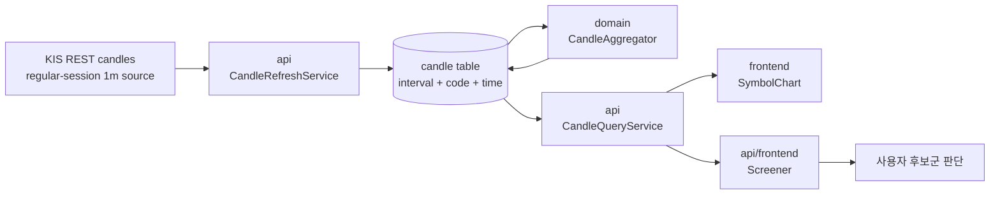

# v3.10.0 Architecture — Candle/Orderblock Screening Boundary

- baseline: v3.10.0
- 작성일: 2026-05-31
- 작성자: architect/orchestrator
- 범위: 캔들 interval 확장, screener 기준봉 선택, 차트 재수집 UX

## 현재 방향

magicJar의 자동매매 본체는 캔들 → 지표/패턴/전략 → 시그널 → 리스크 → 주문으로 흐른다. v3.10.0은 이 중 앞단의 캔들 품질과 후보 탐색만 보강한다. 주문/리스크/실계좌 게이트는 건드리지 않고, FVG/오더블럭 후보를 더 안정적으로 찾을 수 있도록 기준봉과 재수집 도구를 추가한다.

## 아키텍처 경계

## 모듈 영향

| 모듈 | 영향 | 방향성 |
|------|------|--------|
| `domain` | `3m`, `4h`, `12h` 경계/집계 지원 | 순수 도메인 유지 |
| `api` | 캔들 refresh/recollect, screener basis interval | REST 계약 확장 |
| `consumer` | Kafka/Redis/경계 마감 interval 목록 확장 | 기존 topic family 유지 |
| `frontend` | interval selector, screener basis selector, 재수집 버튼 | 기존 Symbol/Screener 화면 안에서 보강 |
| `batch` | 직접 변경 없음 | 전종목 넓은 수집 기본은 `1d` 정책 유지 |

## 자본 흐름 영향

자본 path에는 변경이 없다.

| path | 변경 |
|------|------|
| `order.intent.v1` | 없음 |
| 리스크 게이트 | 없음 |
| 실계좌 3중 게이트 | 없음 |
| KIS 주문 REST | 없음 |
| 체결 동기화 | 없음 |

## 새 계약

| 계약 | 내용 |
|------|------|
| Candle interval | `3m` 추가. UI/REST/MCP/consumer config 목록 정합 |
| Screener request | `interval` 기준봉을 명시 가능. 미지정 기본 `1d` |
| Recollect endpoint | `POST /api/symbols/{code}/candles/recollect?intervals=...` |
| DB migration | `candle.interval` check/constraint에 `3m` 포함 |
| Mock policy | 결측 데이터는 결측으로 둔다. 합성 캔들 금지 |

## 변경 후에도 유지되는 제약

KIS 1분봉은 장중/정규장 제약을 가진다. 따라서 장외 시간에 1분봉을 새로 촘촘히 만들 수 없고, 장기 기준 후보 탐색은 `1d` 또는 이미 저장된 집계봉을 우선 사용한다. 이 제약을 UX에서 숨기지 않는다.

