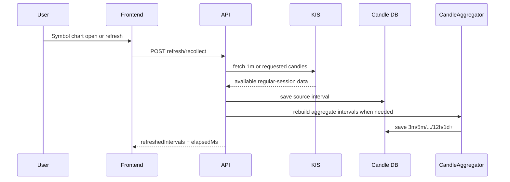

# v3.10.0 Data Flow — Candles, Aggregates, Recollect

- baseline: v3.10.0
- 작성일: 2026-05-31
- 작성자: backend-core/orchestrator

## 수집 흐름

## 1d 넓은 수집과 분봉 후보 탐색

| 목적 | 기본 기준 | 이유 |
|------|-----------|------|
| 전종목 넓은 후보군 | `1d` | KIS 1분봉 장중 제약과 호출량을 피하면서 universe coverage 확보 |
| 사용자가 선택한 정밀 확인 | `3m`~`12h` 등 | 저장된 1m 또는 집계봉 기반으로 세부 후보 확인 |
| 차트 표시 | 현재 선택 interval | 사용자가 보는 화면과 데이터 refresh 범위 일치 |

## 재수집 흐름

재수집은 "이상한 데이터를 정상처럼 덮는" 기능이 아니다. 선택 interval의 기존 rows를 삭제한 뒤 KIS credential을 확인하고, 가능한 소스 데이터를 다시 가져와 저장한다. 집계 interval은 1m 소스 확보 후 재집계한다.

| 요청 interval | 처리 |
|---------------|------|
| `1m` | 1m 삭제 후 재수집, 집계 interval 재생성 |
| `3m`~`12h` | 요청 집계 삭제, 1m 소스 refresh, 해당 집계 재생성 |
| `1d` 이상 | 해당 interval refresh path 사용 |

## 저장/캐시/메시징

| 자원 | 변경 |
|------|------|
| PostgreSQL `candle` | `3m` interval 허용 migration |
| Redis candle cache | `3m` key path 허용 |
| Kafka candle closed topics | topic family는 유지, interval payload 확장 |
| STOMP | 기존 candle/indicator fanout 흐름 유지 |

## 실패 시 의미

| 실패 | 사용자/운영 의미 |
|------|------------------|
| KIS credential 없음 | 삭제 전 차단. 기존 캔들 보존 |
| KIS 응답 실패 | 삭제 이후라면 해당 interval이 비어 있을 수 있음 |
| 1m 소스 부족 | 집계봉도 부족할 수 있음. mock 보정 금지 |
| 장외 1m 요청 | KIS가 제공하지 않는 구간은 결측으로 유지 |

