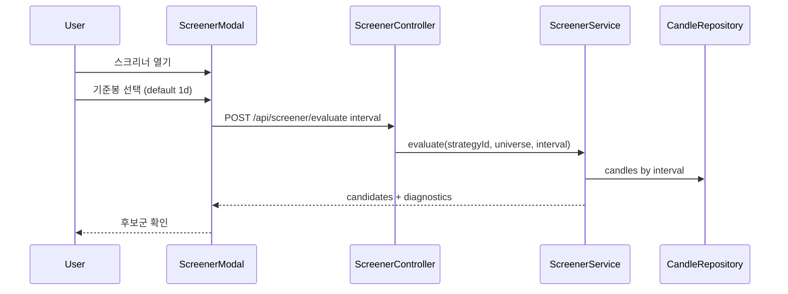
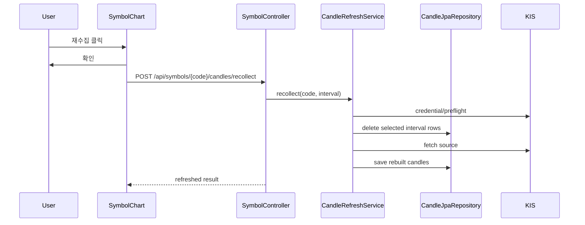

# v3.10.0 Use Sequences — User-Triggered Screening

- baseline: v3.10.0
- 작성일: 2026-05-31
- 작성자: market-data/orchestrator

## S-1. 사용자가 언제든 후보군을 찾는다

밤/낮 같은 실행 시간 이름은 정책으로 두지 않는다. 사용자가 누르면 지금 실행되는 도구다. 다만 데이터 coverage 관점에서 기본값은 `1d`다.

## S-2. 사용자가 분봉/기준봉을 바꿔 다시 본다

| 선택 | 사용 의도 |
|------|----------|
| `1d` | 전종목 넓은 1차 후보 |
| `3m`, `5m`, `15m` | 단기 흐름과 FVG 후보 상세 확인 |
| `30m`, `90m`, `1h` | 중간 추세 후보 확인 |
| `4h`, `12h` | HTF orderblock/FVG 기준 확인 |
| `1wk`, `1mo`, `1y` | 장기 레벨 확인 |

## S-3. 캔들이 이상하면 재수집한다

## KIS 1분봉 제약

KIS 1분봉은 정규장 시간 중심 데이터로 취급한다. 장중에는 1분 소스를 갱신해 집계봉을 즉시 만들 수 있지만, 장외에는 "현재 없는 1분봉"을 새로 만들어낼 수 없다. 이 릴리즈는 그 공백을 보정하지 않고, 사용자가 재수집/스크리닝 결과에서 데이터 부족을 인지할 수 있게 한다.

## 운영자 판단

| 상황 | 판단 |
|------|------|
| 전종목 후보를 넓게 만들고 싶음 | `1d` 수집/갱신 후 screener |
| 특정 종목의 intraday 구조가 이상함 | Symbol Chart 현재 interval 재수집 |
| 3m/4h/12h가 비어 있음 | 1m 소스 부족 또는 장외 제약 확인 |
| 오더블럭 후보가 너무 적음 | 기준봉을 바꾸되 mock 데이터는 넣지 않음 |

