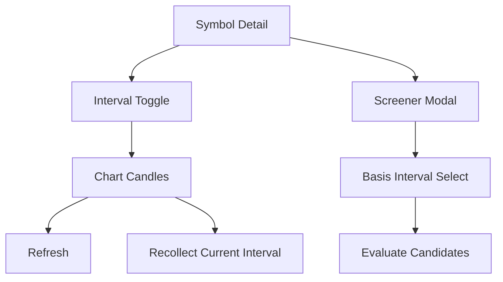

# v3.10.0 UI Inventory — Symbol Chart and Screener

- baseline: v3.10.0
- 작성일: 2026-05-31
- 작성자: frontend/orchestrator

## Symbol Chart

| UI | 변경 |
|----|------|
| interval toggle | `3m`, `4h`, `12h` 포함 |
| candle cap | interval별 max cap에 신규 기준 반영 |
| refresh | 기존 새로고침 유지 |
| recollect | 현재 interval 삭제 후 재수집 버튼 추가 |
| loading state | refresh/recollect 중 버튼 비활성 |

## Screener Modal

| UI | 변경 |
|----|------|
| basis interval selector | `1d` 기본, intraday/HTF 선택 가능 |
| 실행 시점 | 사용자가 원할 때 실행 |
| 결과 | 기존 결과 modal 유지 |
| 오류 | 기존 error path 유지 |

## 사용자 오해 방지

| 상황 | UX 원칙 |
|------|---------|
| 데이터 없음 | "준비/없음"으로 다루며 mock 차트 금지 |
| 재수집 클릭 | 확인창으로 파괴적 동작임을 알림 |
| 장외 1m 부족 | 결과 부족을 정상 데이터처럼 포장하지 않음 |
| 스크리너 기본값 | 넓은 후보 탐색에 적합한 `1d` |

## 화면 흐름

## 회귀 확인 포인트

| 포인트 | 확인 |
|--------|------|
| 긴 interval label | toggle/button 내부 overflow 없음 |
| `재수집` 버튼 | 작은 화면에서 기존 차트 툴바와 겹치지 않음 |
| Screener selector | modal header wrap 허용 |
| 결과 modal | basis 변경 후 재요청 |

